<div align="center">

# BetterThanSpreadsheetsGRC

**An open-source GRC platform for teams who have outgrown spreadsheets but can't afford an enterprise tool.**

Risk registers, compliance assessments, control libraries, third-party risk, and business impact analysis — in one self-hosted app that starts with a single `docker compose up`.

[Quick Start](#quick-start) · [Screenshots](#screenshots) · [Features](#features) · [Install Guide](./INSTALL.md) · [Changelog](./CHANGELOG.md)

</div>

---

> [!WARNING]
> **This is an alpha release, and I am not a professional programmer.** I would not recommend putting this on anything internet-facing — I could easily have missed vulnerabilities. Run it on an internal network, and treat it accordingly. There are still features I'd like to add.

---

## Screenshots

Every screenshot below is the app running against its own demo seed data — what you get on a fresh install.

### Risk Dashboard

Heatmap on a configurable risk matrix, severity distribution, treatment SLA status, and risks ranked by score.

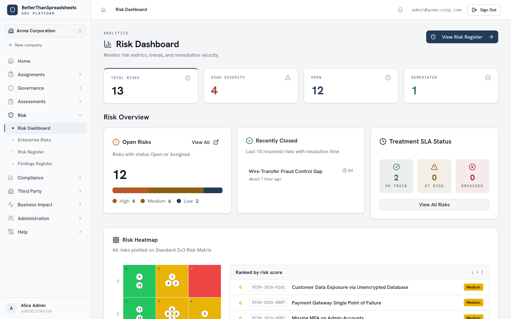

### Findings Register

Track findings from audits and pentests, triage by severity, and accept a finding to convert it into a risk.

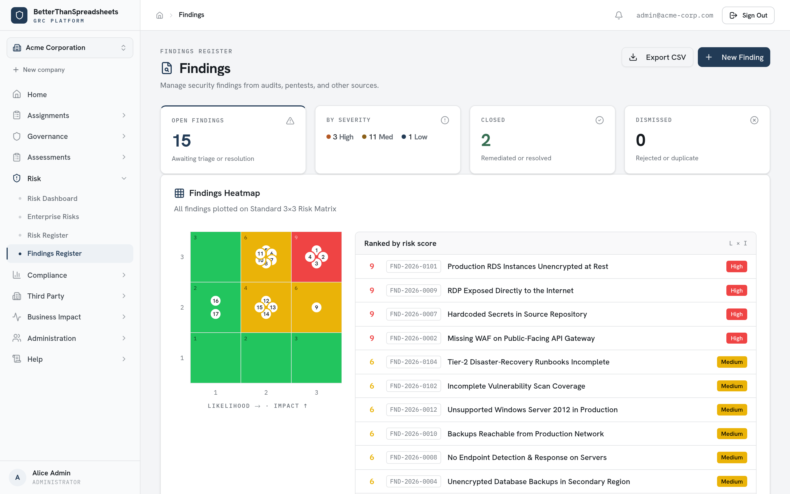

### Compliance Dashboard

Coverage and score per framework, filterable by business unit, with assessment progress at a glance.

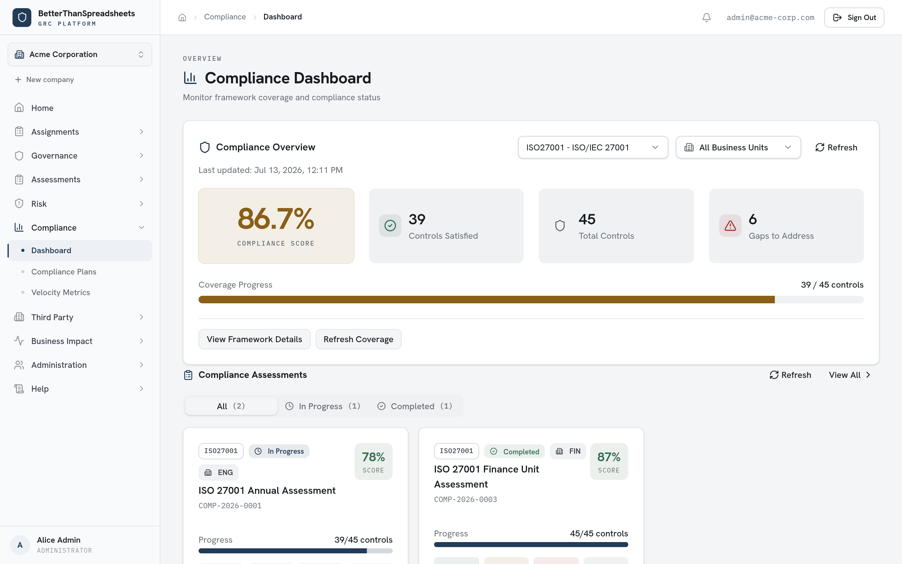

<details>
<summary><b>More screenshots</b> — risk register, control library, frameworks, TPRM, vendors, BIA, risk assessments, home</summary>

### Risk Register

Risks promoted from approved assessments, with treatment status, owner, and SLA tracking.

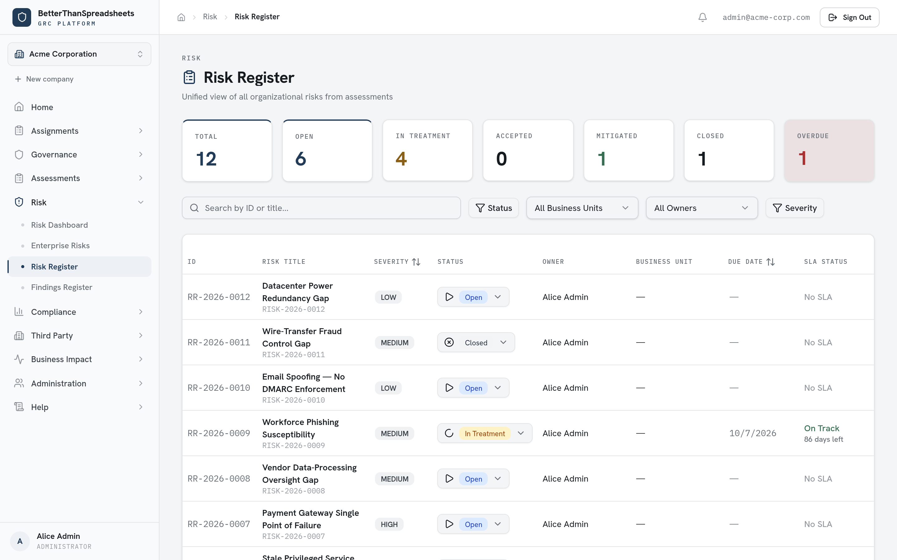

### Framework / Standard Control Library

Every control across every imported framework in one searchable table, with linked risks and findings.

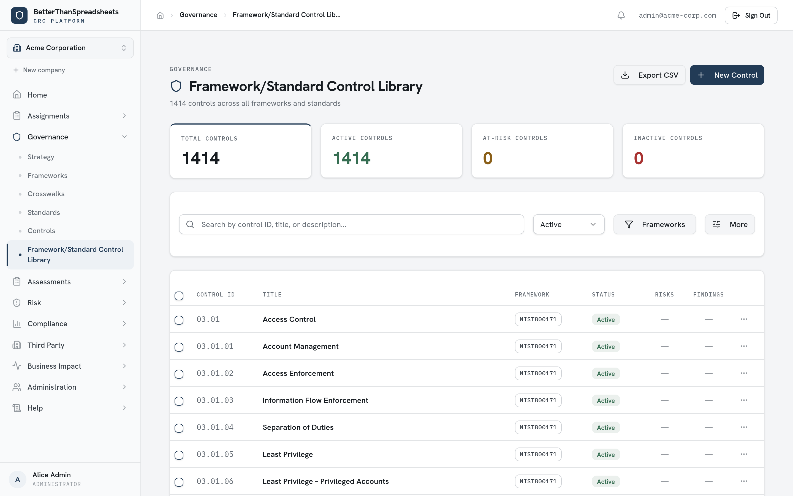

### Framework Management

Import OSCAL catalogs or CSV/XLSX. Ships with NIST CSF 2.0, NIST SP 800-171, NIST SP 800-53r5, and a sample of ISO 27001.

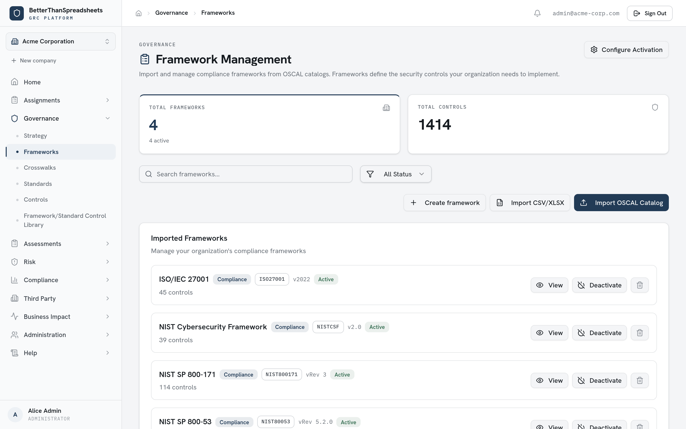

### Third-Party Risk (TPRM)

Vendor risk by tier, assessment coverage, and overdue review alerts.

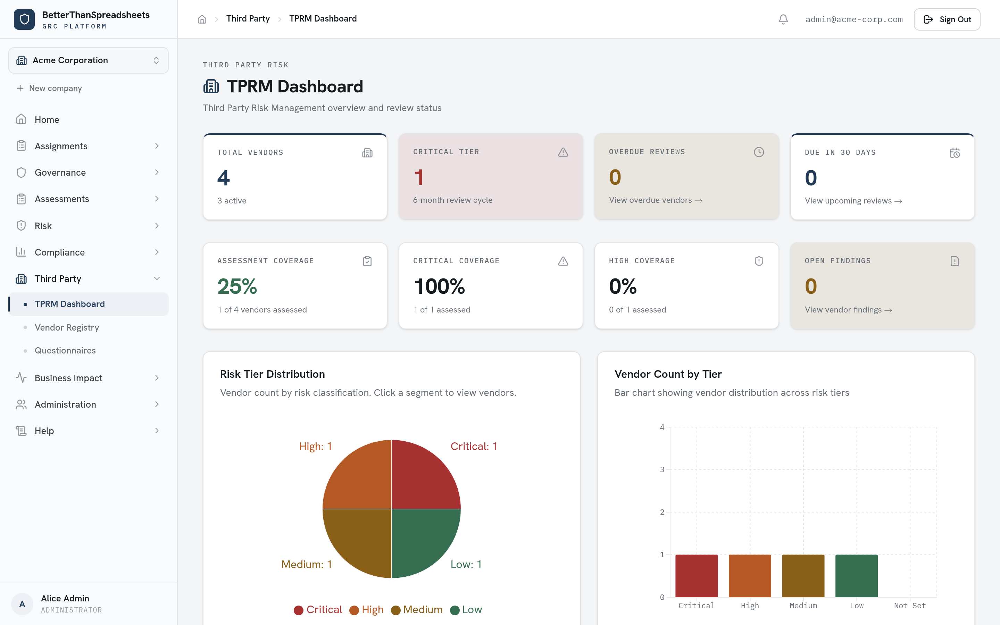

### Vendor Registry

Risk tiering, review scheduling, and business-unit assignment, with bulk CSV import/export.

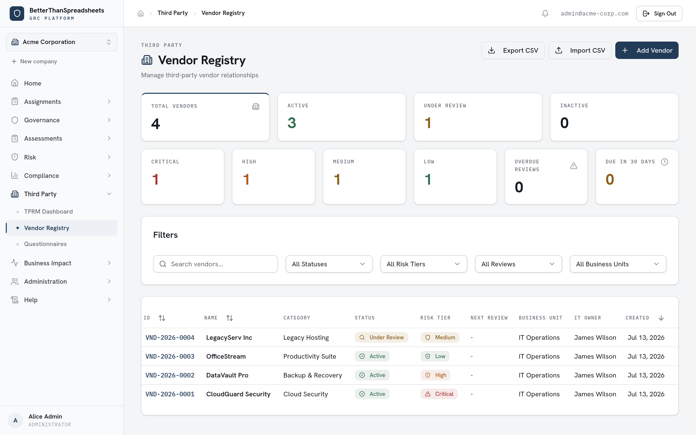

### Business Impact Analysis

Criticality tiers, assessment freshness, and coverage across business processes.

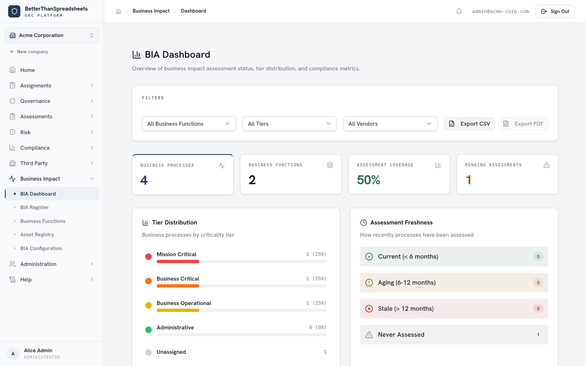

### Risk Assessments

Run assessment projects, claim them from a backlog, and track reassessment schedules.

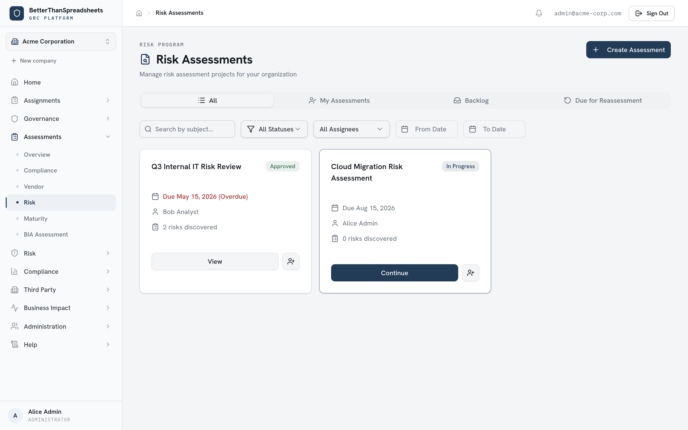

### Home

Your assigned tasks, open risks and findings, and recent activity.

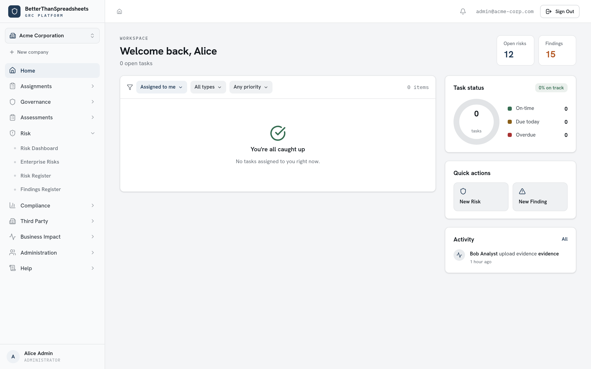

</details>

---

## Quick Start

The app runs entirely in Docker. You do **not** need Node.js, npm, or PostgreSQL on your host — only Docker.

**Prerequisites:** Docker Engine 20.10+ with Compose v2, and port 80 free.

```bash
git clone https://github.com/elbrianmcdonald/BetterThanSpreadsheetsGRC.git
cd BetterThanSpreadsheetsGRC
./start.sh
```

`start.sh` creates `.env`, generates a random `POSTGRES_PASSWORD`, `AUTH_SECRET`, and `CRON_SECRET`, builds the images, starts PostgreSQL and the app, applies the schema, and seeds frameworks + demo data on first run. Expect **3–5 minutes** for the first build.

> **Windows:** run `./start.sh` from Git Bash or WSL, not PowerShell/CMD. To stay in PowerShell, use the manual setup below.

When it finishes, open **<http://localhost>** and sign in with the seeded admin:

| Email | Password |
| --- | --- |
| `admin@acme-corp.com` | `Admin123!@#` |

The seed also creates `analyst@`, `manager@`, and `viewer@acme-corp.com` (same password) so you can see how each role sees the app. **Change these before putting the app anywhere real.**

Subsequent starts are just `docker compose up -d`.

### Manual setup

If you'd rather configure `.env` yourself, or you're on PowerShell:

```bash
# Linux / macOS / Git Bash
./scripts/setup-env.sh

# Windows PowerShell
.\scripts\setup-env.ps1
```

Either script generates all three required secrets into `.env` and is safe to re-run — it never overwrites a value you've already set. Then:

```bash
docker compose up -d --build
```

To manage `.env` entirely by hand, copy `.env.example` and set `POSTGRES_PASSWORD`, `AUTH_SECRET` (`openssl rand -base64 32`), and `CRON_SECRET` (`openssl rand -hex 32`). All three are required — `docker compose up` refuses to start without them.

The app container applies the schema (`prisma db push`) on every start and seeds the database when it's empty, or whenever `SEED_ON_STARTUP=true`. There is no separate migration step to run by hand.

### Verify it's up

```bash
curl http://localhost/api/health
# {"status":"healthy","timestamp":"..."}
```

---

## Features

### Governance
- **Strategy** — Track security strategies by fiscal year with progress, ownership, and lifecycle status.
- **Maturity** — Score organizational maturity against NIST CSF 2.0, C2M2, and OWASP SAMM, current vs. target.
- **Frameworks** — Import OSCAL-formatted frameworks and manage their lifecycle. Ships with NIST CSF 2.0, NIST SP 800-171, NIST SP 800-53r5 (pick your baseline), and a sample of ISO 27001.
- **Control Library** — Search and manage controls across every framework, with health indicators, bulk operations, and CSV export.
- **Crosswalks** — Map controls between any two frameworks using NIST OLIR relationship semantics.
- **Standards** — Registry of internal standards with lifecycle status, review cycles, and CSV import.

### Risk
- **Risk Dashboard** — Heatmap, severity distribution, remediation velocity, and treatment SLA tracking.
- **Risk Register** — Searchable catalog of risks with severity scoring, owner assignment, and CSV export.
- **Findings Register** — Triage findings from audits and pentests; accept one to convert it into a risk.
- **Risk Assessments** — Run assessment projects, claim from a backlog, and track reassessment schedules.
- **Enterprise Risks** — Roll findings and risks up to enterprise-level risk statements.

### Compliance
- **Dashboard** — Coverage percentages across frameworks and business units, with gap analysis.
- **Assessments** — Assess against adopted frameworks and track compliance scores.
- **Evidence** — Upload, tag, and map evidence files to frameworks and control domains, with a full audit trail.
- **Velocity Metrics** — Average days-to-close, broken down by severity, owner, and finding source.

### Third Party
- **TPRM Dashboard** — Vendor risk by tier, assessment coverage, and overdue review alerts.
- **Vendor Registry** — Risk tiering, review scheduling, and business-unit assignment with bulk CSV import/export.
- **Assessments & Questionnaires** — Vendor assessment workflows and customizable security questionnaire templates.

### Business Impact
- **BIA Dashboard** — Coverage, tier distribution, and assessment freshness across business processes.
- **Business Processes & Functions** — Catalog processes with criticality tiering, ownership, and asset links.
- **Asset Registry** — Inventory servers, databases, applications, network gear, and endpoints, linked to processes.
- **BIA Configuration** — Impact categories, scoring scales, RTO/RPO tier definitions, and thresholds.

### Assignments & Administration
- **My Assignments / Backlog** — Kanban board of assigned assessment tasks; claim unassigned work from the backlog.
- **User Management** — Accounts with role-based access control, framework assignments, and business-unit placement.
- **Business Units** — Hierarchical org structure (up to 5 levels) for routing and reporting.
- **Risk Matrices** — Configurable grid sizes, dimensions, and scoring scales.
- **Taxonomy & Mappings** — Control-domain taxonomy and control-to-domain mappings with confidence scoring.
- **MITRE ATT&CK** — Browse tactics and techniques, synced from the STIX repository.

### Planned
- SSO integrations
- Email notifications
- More maturity frameworks

---

## Tech Stack

| Layer | Choice |
| --- | --- |
| Framework | Next.js 15 (App Router) + React 19 |
| Language | TypeScript 5.8 |
| API | tRPC 11 |
| Database | PostgreSQL 15 + Prisma 7 |
| Auth | NextAuth v5 (credentials) |
| UI | Tailwind CSS 4 + shadcn/ui, Recharts |
| PDF export | Puppeteer (Chromium in-container) |
| Deploy | Docker Compose; optional Caddy reverse proxy with auto-HTTPS |

---

## Documentation

| Doc | Covers |
| --- | --- |
| **[INSTALL.md](./INSTALL.md)** | Full deployment: Caddy + Let's Encrypt, existing reverse proxies, ClamAV malware scanning, SendGrid/SES email, backup & restore, troubleshooting. |
| **[DOCKER.md](./DOCKER.md)** | Docker internals, volumes, profiles, and Windows notes. |
| **[DATABASE_SETUP.md](./DATABASE_SETUP.md)** | Schema and database configuration. |
| **[DEVELOPER_INSTRUCTIONS.md](./DEVELOPER_INSTRUCTIONS.md)** | Local development workflow. |
| **[CHANGELOG.md](./CHANGELOG.md)** | Release history (also readable in-app at `/changelog`). |

### Docker profiles

The default `docker compose up -d` starts just the app and PostgreSQL. Extras are opt-in:

```bash
docker compose --profile production up -d   # + Caddy reverse proxy, auto-HTTPS on :443
docker compose --profile clamav up -d       # + ClamAV malware scanning for uploads
```

---

## Project Structure

```
BetterThanSpreadsheetsGRC/
├── src/
│   ├── app/              # Next.js App Router — one directory per screen
│   ├── components/       # Shared UI (shadcn/ui in components/ui)
│   ├── server/
│   │   ├── api/routers/  # tRPC routers — the API surface
│   │   ├── auth/         # NextAuth configuration
│   │   └── db.ts         # Prisma client
│   └── styles/
├── prisma/
│   ├── schema.prisma     # Database schema
│   └── seed.ts           # Frameworks + demo data seeded on first run
├── e2e/                  # Playwright end-to-end tests
├── scripts/              # setup-env, admin creation, maintenance jobs
├── docs/screenshots/     # Images used by this README
├── docker-compose.yml    # app, postgres, caddy, clamav, test
├── Dockerfile            # Multi-stage build (standalone Next.js output)
└── Caddyfile             # Reverse proxy config (production profile)
```

---

## License

See the repository for license details.
