# User Guide

How to use BetterThanSpreadsheetsGRC day to day.

This guide covers the workflows most people use: signing in, managing risks, raising findings,
running compliance assessments, and assessing vendors. The product does more than this — see
[Where to go next](#where-to-go-next) for the areas this guide does not cover.

Every screenshot here was taken from a running instance loaded with the built-in demo data
(Acme Corporation), so what you see below is what you will see on screen.

**Deploying it, rather than using it?** See [INSTALL.md](INSTALL.md), [DOCKER.md](DOCKER.md), or
[AZURE.md](AZURE.md).

---

## Contents

- [Signing in](#signing-in)
- [Understanding roles](#understanding-roles)
- [Finding your way around](#finding-your-way-around)
- [Managing risk](#managing-risk)
  - [How a risk is scored](#how-a-risk-is-scored) ← read this one
  - [Create a risk](#create-a-risk)
  - [Work a risk](#work-a-risk)
- [Findings](#findings)
- [Compliance assessments](#compliance-assessments)
  - [Score the controls](#score-the-controls)
  - [Turn gaps into a plan](#turn-gaps-into-a-plan)
- [Vendors and third-party risk](#vendors-and-third-party-risk)
- [Where to go next](#where-to-go-next)

---

## Signing in

Go to your instance's URL and sign in with the email and password your administrator gave you.

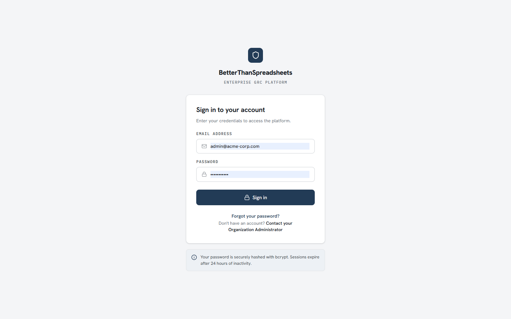

> ### ⚠️ If this is a fresh install, change the demo passwords
>
> A newly seeded instance ships with demo accounts — `admin@acme-corp.com`, `analyst@acme-corp.com`,
> `manager@acme-corp.com`, `viewer@acme-corp.com` — that **all share the same password, and that
> password is published in this project's source code.** Anyone who can reach your instance can sign
> in as an administrator.
>
> Before you put real data in: sign in, change the admin password (see [Your profile](#your-profile)),
> and delete or re-password every demo account you are not using.

Forgot your password? Use **Forgot password** on the sign-in page. What happens next depends on how
your administrator configured email — if no mail provider is set up, the reset link is shown on
screen rather than emailed.

## Understanding roles

Your role decides what you can see and do. If a menu item in this guide isn't visible to you, your
role is usually why.

| Role | What it can do |
|---|---|
| **Administrator** | Everything, including user management, frameworks, and system settings. |
| **Manager** | Everything an Analyst can do, **plus** assigning risks and approving work. |
| **Analyst** | Create and edit risks, findings, assessments, vendors, and evidence. Cannot assign risks or administer the system. |
| **Business User** | **Read-only.** Can view and export, but cannot create or change anything. |

## Finding your way around

Signing in lands you on **Home** — your workspace.

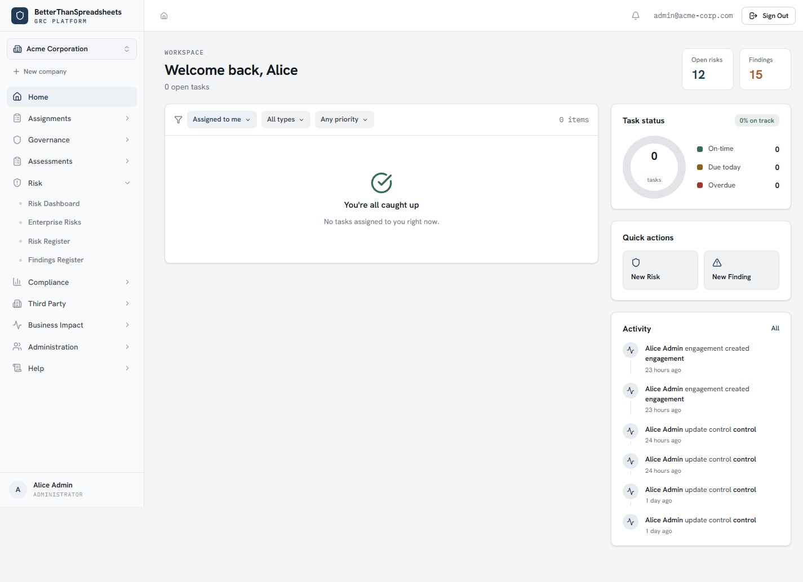

Three things to know here:

- **The task list in the middle is yours.** It shows only work assigned to *you*, grouped by when
  it is due. "You're all caught up" means nothing is waiting on you — it does not mean the
  organization has no open work.
- **The cards top-right are the organization's numbers** — open risks, findings, task status.
- **Quick actions** give you one-click **New Risk** and **New Finding**.

The **left sidebar** is the main navigation, grouped by area: Assignments, Governance, Assessments,
Risk, Compliance, Third Party, Business Impact, Administration. Click a section to expand it.

If you belong to more than one organization, the **company switcher** sits at the top of the
sidebar. Everything you see — risks, findings, assessments — belongs to the company selected there.
Switching companies switches the entire workspace.

### Your assignments

**Assignments → My Assignments** is your personal queue across every kind of work: risks, findings,
assessments, and business-impact reviews.

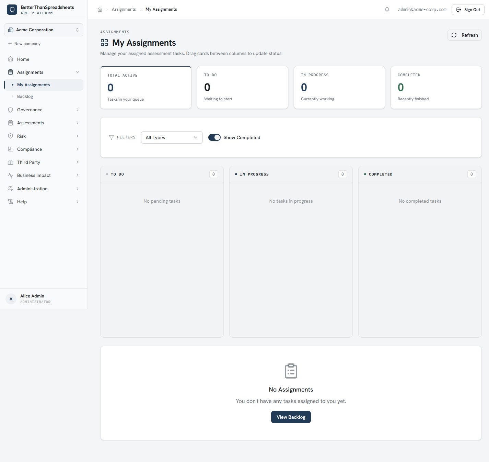

Analysts and Administrators also see **Backlog** — the pool of unassigned work to pick up or hand
out.

### Your profile

Click your name at the bottom of the sidebar to reach **Profile Settings**, where you change your
password.

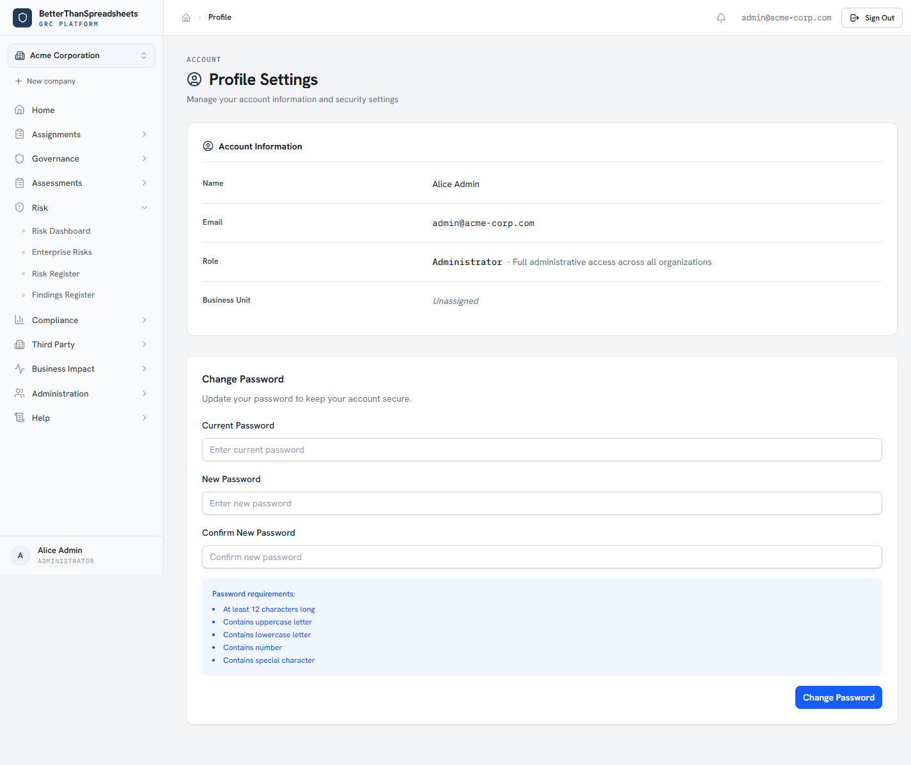

Passwords must be at least 12 characters, with an uppercase letter, a lowercase letter, a number,
and a special character.

---

## Managing risk

### How a risk is scored

**Read this before creating anything.** It is the one concept in the product that surprises people.

A risk's severity is **calculated from the findings linked to it** — specifically, from the
highest-scored open finding. Findings are the evidence; the risk score is the consequence.

You can also **override** the calculated score with a manual judgment. When an override is set, it
wins. The risk detail page always shows you both numbers, so you can see what the evidence says and
what a human decided.

A risk is never unscored. Link findings, set a manual score, or do both.

### Create a risk

**Risk → Risk Register → Create Risk**.

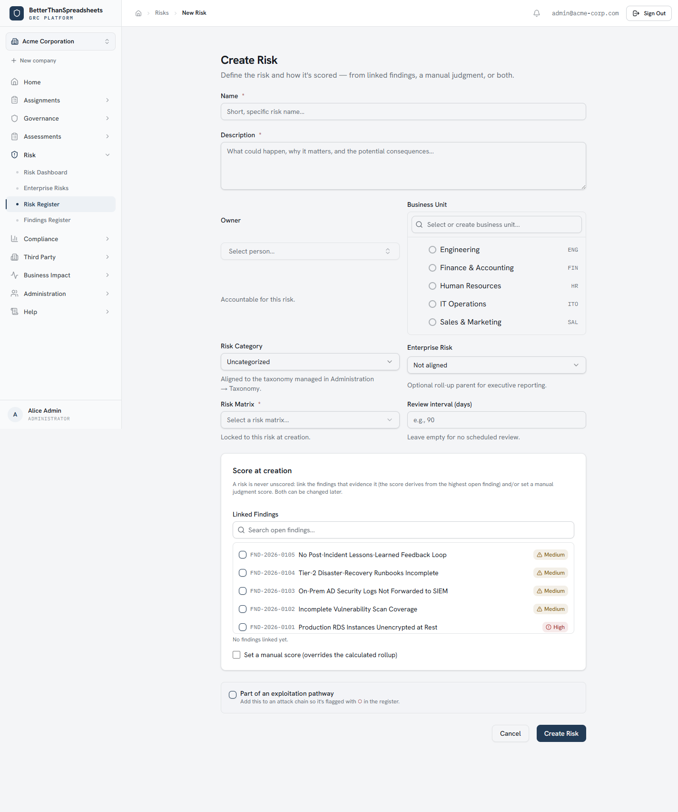

- **Name** and **Description** are required.
- **Owner** is who is accountable for the risk.
- **Risk Matrix** is required and is **locked once the risk is created** — you cannot change it
  later, so pick the right one now. (Out of the box, the default is a 3×3 matrix.)
- **Score at creation** is where the concept above becomes concrete: tick the findings that evidence
  this risk, and/or tick **Set a manual score** to override.
- **Enterprise Risk** is optional, and rolls this risk up to a top-level category for executive
  reporting.

### Work a risk

The **Risk Register** (Risk → Risk Register) is the full list, with search, filters, and CSV export.

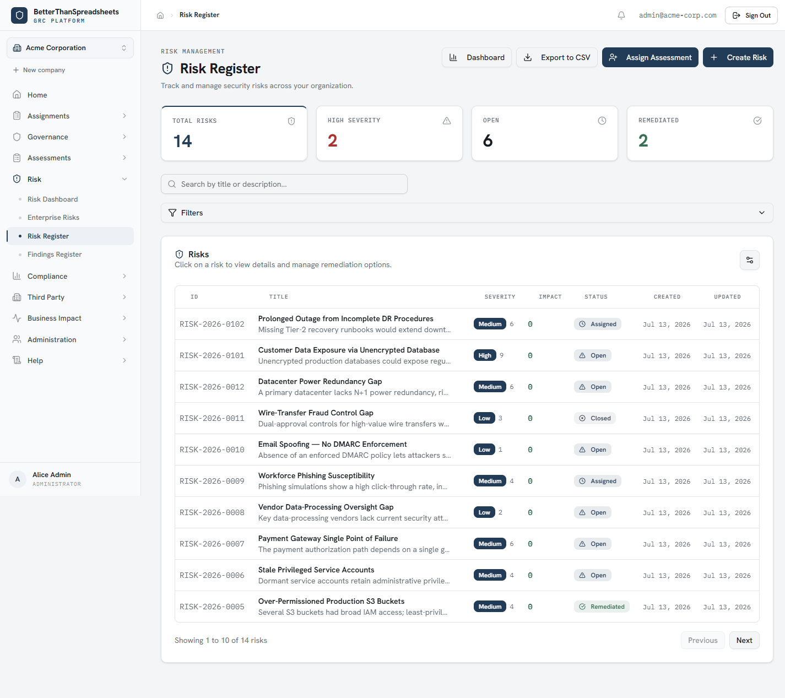

Click any risk to open it.

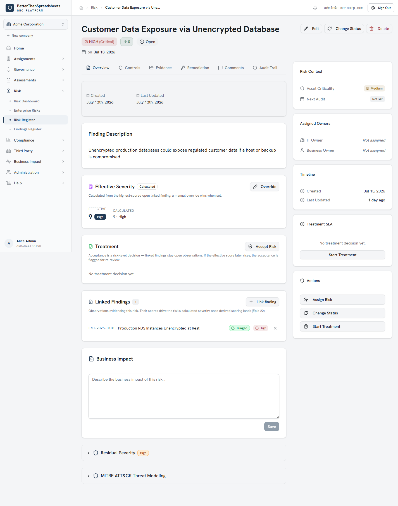

The **Effective Severity** card is the heart of the page. Here it reads `EFFECTIVE 9 · High` with a
`Calculated` badge, meaning the score came from the linked finding below it (FND-2026-0101, a High).
Press **Override** to substitute your own judgment.

From here you can:

- **Link a finding** — adding evidence, which may change the calculated score.
- **Start Treatment** — record what you are doing about it, and start the treatment SLA clock.
- **Accept Risk** — a risk-level decision. Note that accepting a risk does **not** close the linked
  findings; they remain open observations. If the score later rises, the acceptance is flagged for
  re-review.
- **Assign Risk** — hand it to someone. Requires Manager or Administrator.
- Use the tabs — **Controls**, **Evidence**, **Remediation**, **Comments**, **Audit Trail** — to
  attach mitigating controls, upload evidence, and see the full history of who changed what.

### The risk dashboard

**Risk → Risk Dashboard** is the reporting view: a heatmap of every risk on your matrix, risks
ranked by score, treatment SLA status, and remediation velocity.

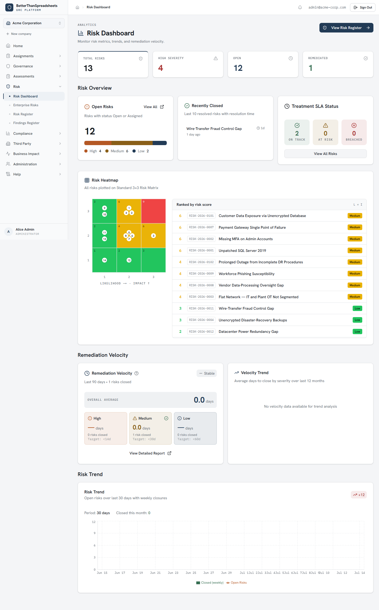

---

## Findings

A finding is a specific, observed weakness — from a scan, a pentest, an audit, or manual
observation. Findings are the evidence that drives risk scores.

**Risk → Findings Register** lists them all, with their own heatmap.

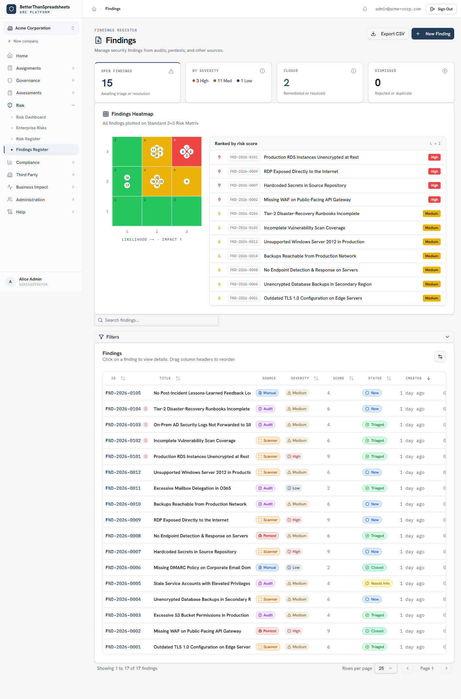

Findings carry a **source** (Manual, Audit, Scanner, Pentest) and move through a lifecycle:
**New → Triaged → Closed**, with **Needs Info** for when you are waiting on someone.

### Raise a finding

**New Finding**, from the register or the Home quick actions.

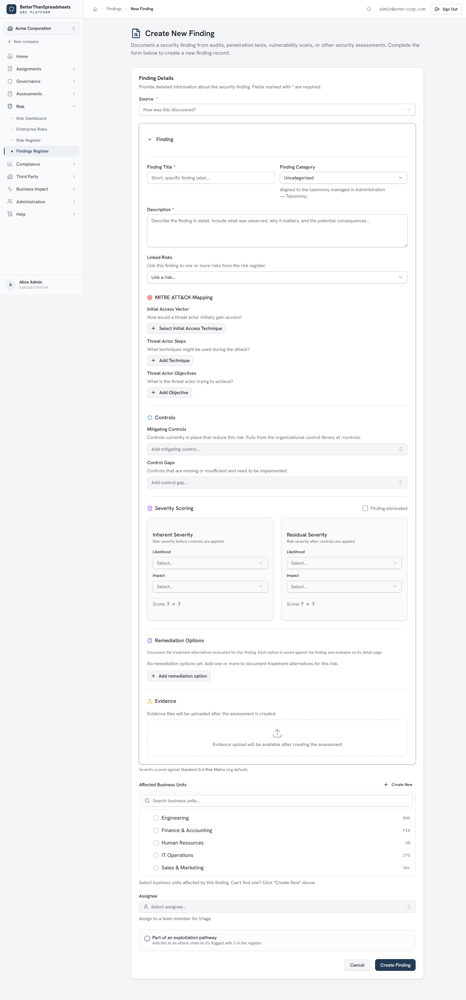

The form is long, but only three fields are marked required: **Source**, **Finding Title**, and
**Description**. Score the severity anyway — an unscored finding contributes nothing to the risks
you link it to. The rest of the form earns its keep as you mature:

- **Severity Scoring** — score **Inherent** severity (likelihood × impact, before controls) and
  **Residual** severity (after controls). This is what feeds any risk you link this finding to.
- **Linked Risks** — connect the finding to risks in the register. This is the bridge into the risk
  workflow: link it here, and the risk's calculated score updates.
- **Controls** — record which controls mitigate it, and which are missing.
- **MITRE ATT&CK Mapping** — map how an attacker would exploit it.
- **Affected Business Units** and **Assignee** — who owns fixing it.

---

## Compliance assessments

An assessment measures your organization against a framework, control by control.

### Start an assessment

**Assessments → Compliance** shows your active frameworks. A fresh install includes ISO/IEC 27001,
NIST CSF, NIST SP 800-171, and NIST SP 800-53.

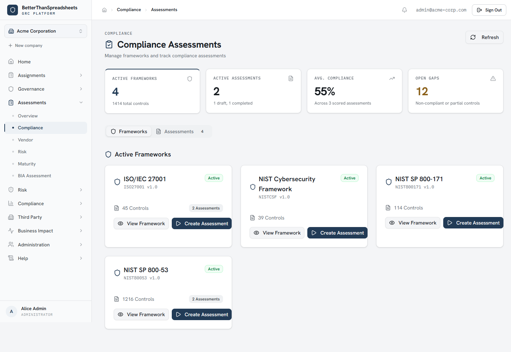

Press **Create Assessment** on the framework you want to measure against. Switch to the
**Assessments** tab to see the ones already under way, with their compliance percentage and
progress.

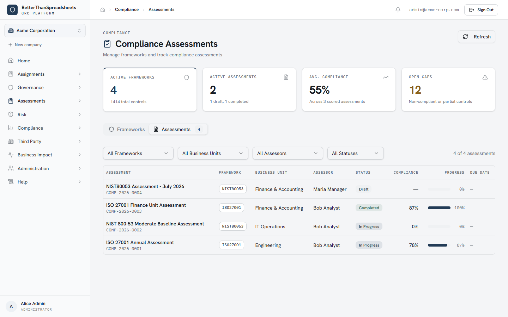

### Score the controls

Open an assessment and go to the **Controls** tab. Controls are grouped; click a group to expand it.

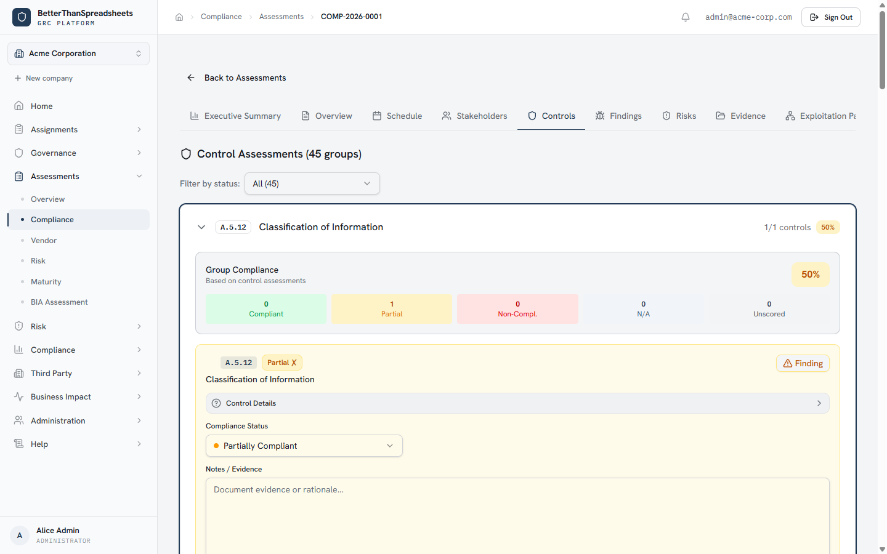

For each control, set a **Compliance Status** — Compliant, Partially Compliant, Non-Compliant, or
N/A — and record your rationale in **Notes / Evidence**. The group's percentage and the assessment's
overall score update as you go.

The **Finding** button on each control is the useful one: it raises a finding directly from a control
gap, which then flows into the risk register through the normal findings workflow.

The other tabs on an assessment — **Executive Summary**, **Findings**, **Risks**, **Evidence**,
**Exploitation Path** — build up a report you can hand to leadership. **Export PDF** produces the
document.

### Turn gaps into a plan

A finished assessment tells you what is broken. A **Compliance Plan** (a POA&M) tracks fixing it.

**Compliance → Compliance Plans → Create plan**, then open it.

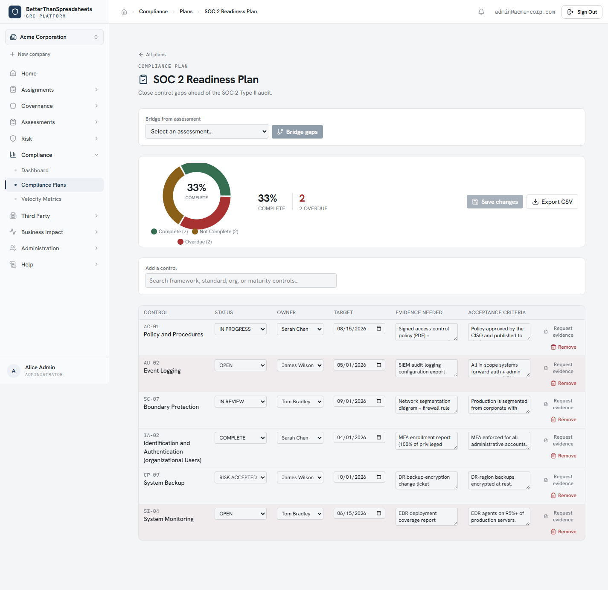

The **Bridge gaps** control at the top is the point of the page: pick a completed assessment, press
it, and every non-compliant control becomes a plan item automatically. You don't retype anything.

Each item then gets an **owner**, a **target date**, a **status** (Open, In Progress, In Review,
Complete, Risk Accepted), the **evidence needed** to close it, and the **acceptance criteria** that
define done. **Request evidence** emails the owner to ask for it.

---

## Vendors and third-party risk

### Add a vendor

**Third Party → Vendor Registry** is the list of your third parties, tiered by risk.

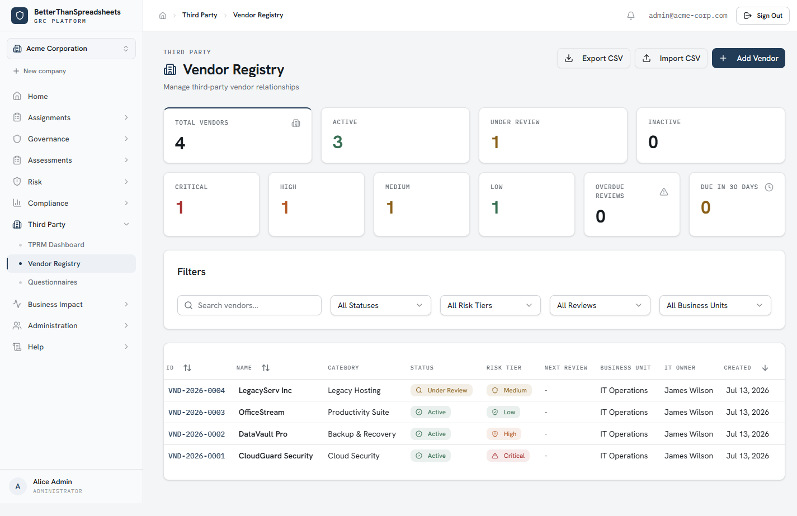

**Add Vendor** creates one. **Import CSV** bulk-loads them if you are migrating from a spreadsheet.

Each vendor carries a **risk tier** (Critical, High, Medium, Low) and a **status** (Active, Under
Review, Inactive), plus an IT owner and a next-review date.

### Assess a vendor

**Assessments → Vendor → New Assessment** starts a vendor assessment.

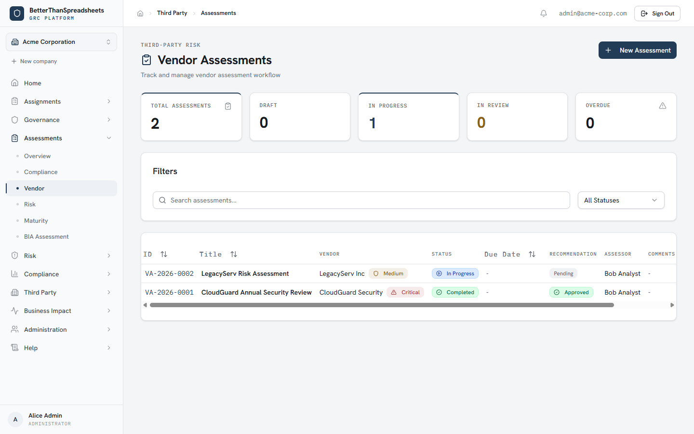

An assessment produces a **risk score out of 100** and a **recommendation** (Approve, Pending, and
so on). It reads as a finished report — **Export PDF** hands it to stakeholders, and **Present**
opens a full-screen view for walking through it in a meeting.

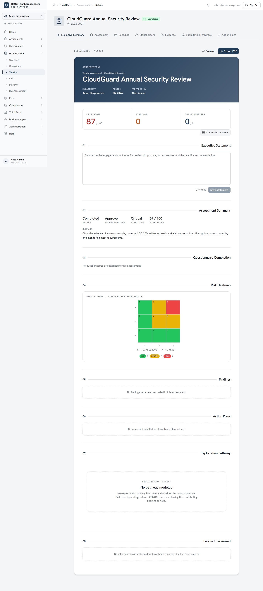

### Questionnaires

**Third Party → Questionnaires** is where you build the question sets you send to vendors.

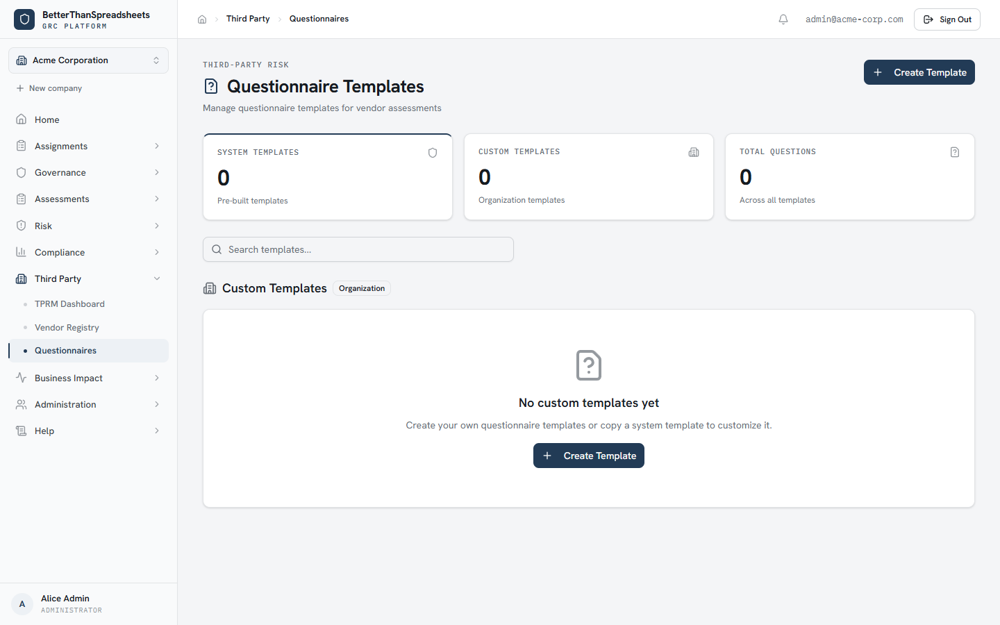

The round trip is: build a template → attach it to a vendor assessment → send it → **the vendor
completes it through a link, without needing an account on your system** → you review their
responses and score the assessment.

---

## Where to go next

This guide deliberately covers the common path. The product has more in it, reachable from the
sidebar:

| Area | Where | What it's for |
|---|---|---|
| **Business Impact (BIA)** | Business Impact | Score business processes for impact and recovery time; track assets and contingency plans. |
| **Governance** | Governance | Strategy and objectives, organizational standards, your own control library, and crosswalks that map one framework's controls onto another's. |
| **Frameworks** | Governance → Frameworks | Import your own framework from a CSV, view control gaps, and reconcile against a new version. |
| **Maturity** | Assessments → Maturity | Maturity scoring (NIST CSF, C2M2, OWASP SAMM) — distinct from compliance scoring. |
| **Evidence** | Administration → Evidence | The evidence library, and the request/fulfil round trip. |
| **Enterprise Risks** | Risk → Enterprise Risks | Top-level risk categories that individual risks roll up into. |
| **Administration** | Administration | Users, business units, risk matrices, taxonomy, backups. Administrator only. |

Two things worth knowing that aren't in the sidebar:

- **Maturity assessments are empty on a fresh install.** The maturity *frameworks* ship with the
  product, but no assessments are seeded — so those screens look blank until you create one. That's
  expected, not a fault.
- **Nothing runs the scheduled jobs for you.** Evidence-request reminders and SLA breach detection
  only fire if your administrator has pointed a scheduler at the app's cron endpoints. If reminders
  never arrive, that is the first thing to check — see [INSTALL.md](INSTALL.md#scheduling-cron-jobs).
